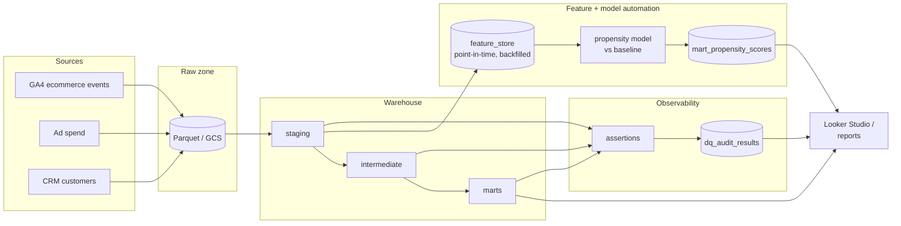
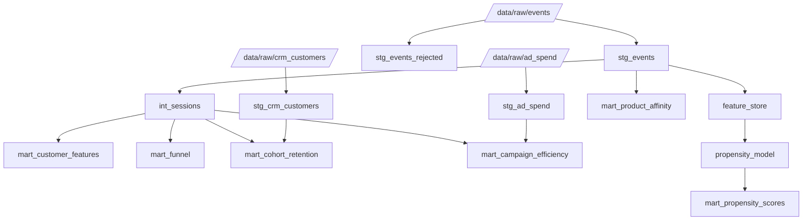

# Architecture

## Platform overview

- **Local prototype:** raw = Parquet, warehouse = DuckDB, transforms = a small SQL runner,
  checks = a YAML-driven assertion engine, model = scikit-learn.
- **GCP build:** raw = Cloud Storage + GA4 public dataset, warehouse = BigQuery, transforms +
  assertions = Dataform, ingestion at scale = Apache Beam / Dataflow, reporting = Looker Studio.
  See [`/bigquery`](../bigquery/README.md).

## Pipeline DAG (model dependencies)

## Point-in-time correctness (no leakage)

Every feature is computed only from events with `event_timestamp <= as_of_date`; the label is
computed only from events in `(as_of_date, as_of_date + horizon]`. The feature store is backfilled
across multiple `as_of` cutoffs, and the model is evaluated **walk-forward** (train on earlier
cutoffs, validate on the most recent). A build-time assertion fails the run if any feature row
implies future data leaked in.
